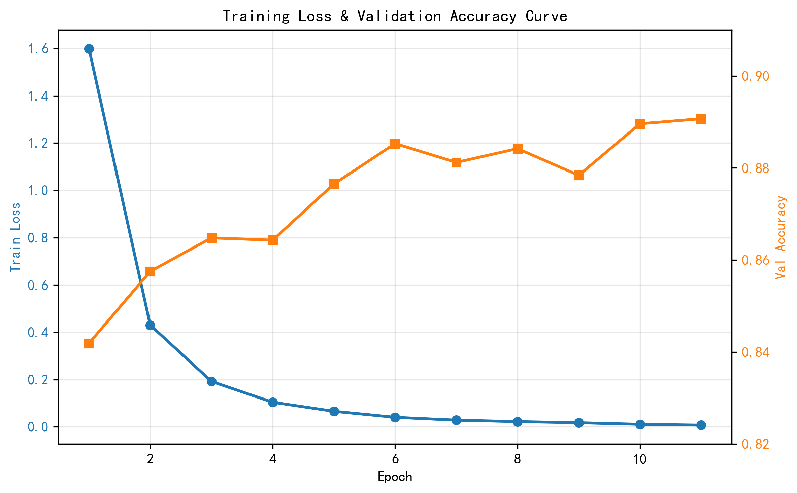
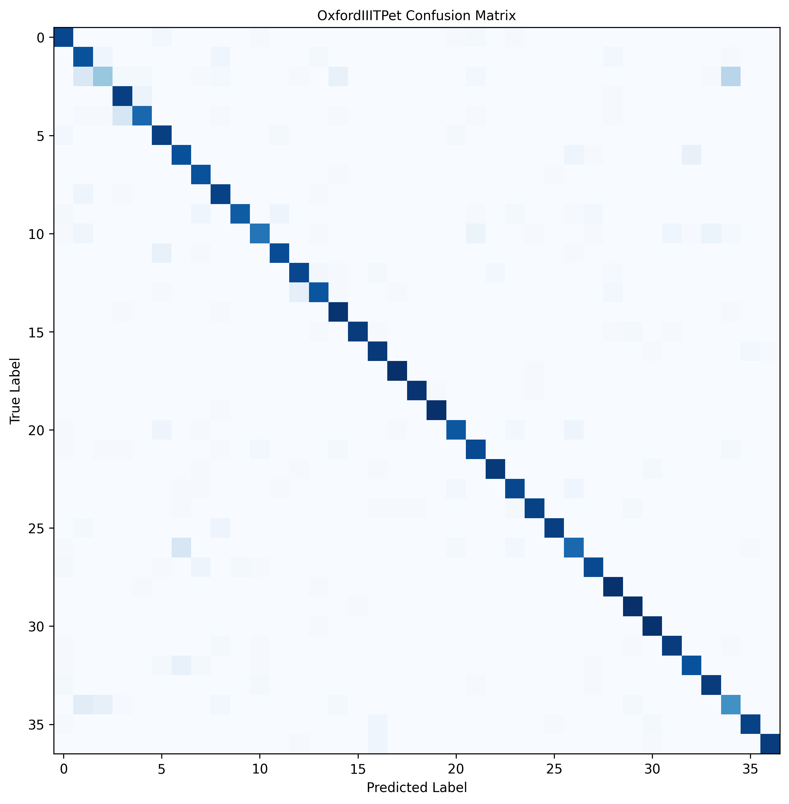
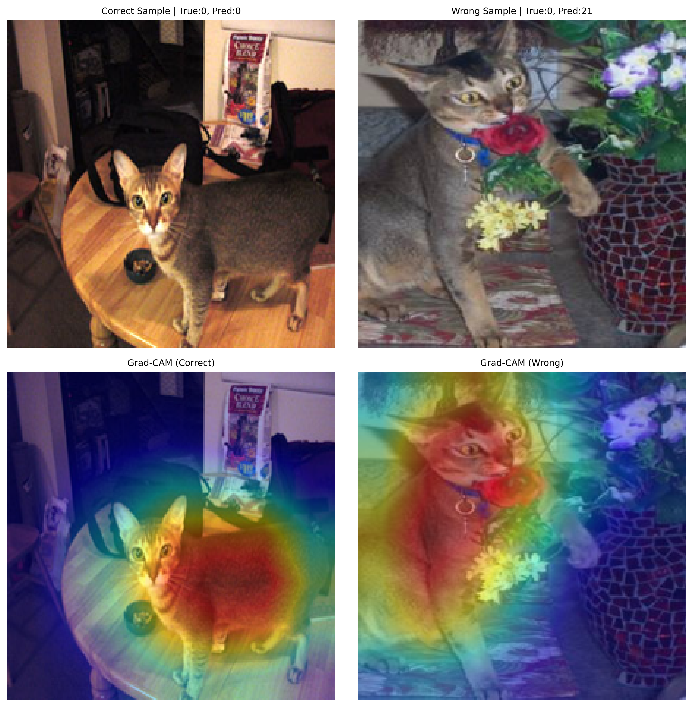

# OxfordIIITPet ResNet18 宠物分类项目

基于PyTorch + ResNet18迁移学习实现37类宠物品种分类，包含模型训练、混淆矩阵评估、Grad-CAM可解释性可视化全流程。

## 🚀 一键复现
### 环境要求
```bash
pip install torch torchvision tqdm scikit-learn grad-cam matplotlib
```

### 训练+评估一键运行
```bash
python main.py
```
自动完成：数据集下载 → ResNet18模型初始化 → 11轮训练 → 保存最优权重 → 生成混淆矩阵 → 生成Grad-CAM热力图。

## 📂 项目结构
```
.
├── dataset.py          # OxfordIIITPet数据集加载与预处理
├── model.py            # ResNet18模型定义（修改全连接层适配37类）
├── train.py            # 训练循环，自动保存最优模型权重
├── evaluate.py         # 测试集评估 + 37类混淆矩阵绘制
├── gradcam_viz.py      # Grad-CAM类激活热力图可视化
├── main.py             # 主入口，串联全流程
└── checkpoints/
    └── best_model_oxford.pth  # 训练完成后自动生成最优权重
```

## 📊 实验结果
- 数据集：OxfordIIITPet 37类猫狗品种
- 模型：ResNet18 迁移学习（ImageNet预训练骨干）
- 训练配置：Adam优化器，lr=1e-4，batch_size=32，11轮epoch
- 测试集最佳准确率：**89.07%**

### 训练曲线


### 混淆矩阵


### Grad-CAM可解释性可视化


## 📝 技术报告
完整2-3页技术报告见 `DL_Experiment_Report_final.pdf`。
